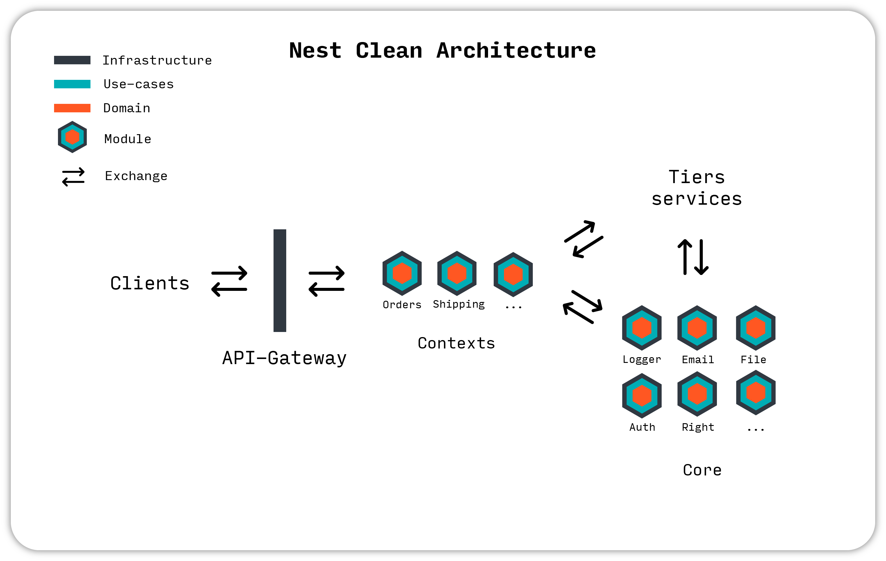

<div align="center">

[](https://github.com/juliandavidmr/awesome-nestjs)
[](http://commitizen.github.io/cz-cli/)

</div>

# Motivation

> FP and OO work nicely together. Both attributes are desirable as part of modern systems. A system that is built on both OO and FP principles will maximize flexibility, maintainability, testability, simplicity, and robustness. Excluding one in favor of the other can only weaken the structure of a system. - Uncle Bob.

This repository aims to provide to people an opinionated starter/example project to help them to architecture their next project.

The [Nest.js](https://nestjs.com/) framework has been chosen for its convenience as it provides out-of-the-box great solutions for modularity, dependency injection, publish-subscribe pattern, error handling, security etc.

This project uses OOP to handle modularity (modules instances) and on the other hand it uses the convenience of FP to write use-cases as smooth data flows while embracing eventual errors.

Functionnal Programming may look intimidating, if you are new to it, you should [read the most adequate guide](https://mostly-adequate.gitbook.io/mostly-adequate-guide/) to learn more about it.

# Project Overview



Clients interacts with the system through the [api-gateway](./api-gateway): the endpoints. The concerned module, executes the corresponding use-case which orchestrate the domain and perform I/O using its injected adapters.

The **domain modules** are tightly **concerned by the overall goal of the application**, while the **common modules** are **business-agnostic** and only serves as support to decouple logic and responsabilities in the entire system.

# Getting started (1 min)

Make sure to have docker installed, otherwise [install it here](https://docs.docker.com/get-docker/).

1. Clone the project

```
git clone https://github.com/VincentJouanne/nest-clean-architecture-ddd-example.git
```

2. Fetch dependencies

```
cd nest-clean-architecture-ddd-example && yarn install
```

3. Start the server

```
yarn start
```

4. Go to http://localhost:3000/api

5. Run unit tests

```
yarn test:unit
```

6. Mount docker container

```
yarn docker:up
```

7. Run integration tests

```
yarn test:inte
```

8. Run e2e tests

```
yarn test:e2e
```

# Tests

## Unit tests

One of the most controversial subject in Software development is **unit testing**.

What and how should we test ?

Unit test should **focus on the business value** of your application: the use-cases.

They have to be **really fast (< x0 ms)** in order to iterate quickly on the algorithm we are working on.

In the outside world, we distinguish two approaches for unit testing: [the Classicist vs the Mockist](https://martinfowler.com/articles/mocksArentStubs.html).

This project uses the classicist approach in order to **focus on the result of the behavior of the use-cases and not on how the behavior has been implemented**: this leads to more meaningful tests, with a lighter syntax.

So, use-cases are black-boxed tested with fake secondaries adapters injected at the beginning of the test suite.

I/O: A use-case.


## Integration tests

Integration tests focuses on **testing if tier services are well integrated** with our system.

To have relevant integration test, we want to create a testing environment as close as possible to a production one.

For example, to test a repository, we will have a local database and make access to it as we would do in production.

This kind of environment can be easily setup thanks to [docker containers](https://docs.docker.com/get-started/#what-is-a-container).

They are slower than unit tests since they need an heavier environement. They usually **takes up to < x00 ms**.

I/O: A real secondaries adapters.


## End-to-end tests

End-to-end tests focuses on testing a whole flow: one endpoint.

They use our use-cases and real adapters in order to check if the flow under test behave as expected.

They usually **takes up from < x00 ms to < x000 ms**.

It allows us to check if our endpoints are accessible from the outside world and what are their responses.

Those tests also wants to reproduce as possible a production enviroment, so they use the real implementations.

The services that are too weird to keep in the test (mailing for example) will be doubled by a fake implementation.

I/O: An endpoint.


